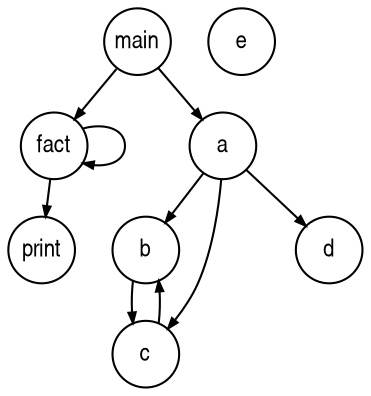

# Refactor sample
## Generate lexer and parser
```shell
antlr PropertyFile.g4 
```

## Gererate visitor
```shell
antlr -visitor PropertyFile.g4 
```

# Listener sample
## Generate lexer and parser
```shell
antlr Expr.g4 
```


# Graph

